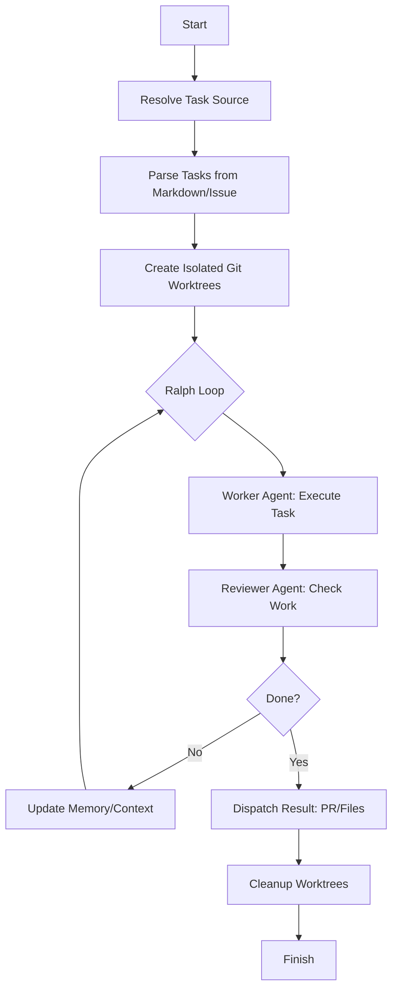

# MOCHI Architecture Guide

This guide explains the internal workings of **MOCHI** (Multi-Task AI Coding Orchestrator), a Go-based system designed to manage and execute multiple AI coding tasks in parallel using isolated environments.

---

## 1. High-Level Flow

MOCHI follows a **Research -> Execute -> Review -> Refine** lifecycle, which we call the **Ralph Loop**.

---

## 2. Core Components

### A. Go Orchestrator (`internal/orchestrator`)
The Orchestrator is the central controller. It initializes the `worktree.Manager`, parses the task source, and manages the execution pool.
- **Task Resolution**: If an `--issue` number is provided, it uses the GitHub API to fetch the issue body and treats it as a Markdown task source. Otherwise, it reads from a local file (e.g., `PRD.md`).
- **Execution Strategy**: It supports both sequential and parallel execution. In parallel mode, each task is wrapped in a goroutine with a `sync.WaitGroup` to ensure all tasks finish before cleanup.
- **Dry Run Mode**: Validates the task source and shows the planned worktrees and branches without executing any AI models.

### B. Git Worktree Manager (`internal/worktree`)
MOCHI leverages `git worktree` to create isolated file systems for each task. This is critical for parallel execution without state corruption.
- **Creation**: Runs `git worktree add -b <branch> <path> <base>`. The `base` is typically the current branch or a user-specified `--base-branch`.
- **Branch Safety**: The manager includes a `resolveBranch` method that checks if a branch name exists (`git branch --list`). If it does, it appends a numeric suffix (e.g., `-2`, `-3`) to prevent collisions.
- **Manifest Tracking**: A local `.mochi_manifest.json` file is maintained at the repository root. It tracks the `slug`, `path`, `branch`, and `status` of every active worktree. This allows the system to clean up properly even if a run is interrupted.

### C. The Ralph Loop: Iterative Refinement
The Ralph Loop is the heart of MOCHI's intelligence. It consists of a Worker pass followed by a Reviewer pass.

#### 1. The Worker (`internal/agent`)
The Worker receives a prompt constructed from a Go template. This prompt includes:
- **Task Description**: The specific bullet point from the task list.
- **Contextual Memory**: Content from `FEEDBACK.md`, `PROGRESS.md`, and `AGENTS.md` (if they exist from a previous iteration).
- **Environment**: The worktree path and current branch.
The Worker is instructed to commit its changes locally once finished.

#### 2. The Reviewer (`internal/reviewer`)
The Reviewer is a separate LLM call (potentially using a more powerful model like `gemini-1.5-pro` or `claude-3-5-sonnet`). It evaluates the Worker's output (stdout/stderr) against the original task.
- **Parsing the Verdict**: The system parses the Reviewer's output for two specific signals:
    - `DONE`: Signals the loop to terminate successfully.
    - `RETRY: <feedback>`: Captures the feedback and triggers another Worker iteration.
- **Fallback**: If the reviewer's response is ambiguous, it defaults to a `RETRY` with the raw output as feedback.

#### 3. Constraints & Retries
The Ralph Loop is bounded by two main safety limits:
- **`MaxIterations`**: This defines the maximum number of "retries" or refinement cycles. If a task hasn't reached `DONE` by this limit, MOCHI marks it as failed to avoid infinite loops and token waste.
- **`Timeout`**: Each individual agent invocation (Worker or Reviewer) is wrapped in a Go context with a timeout (default 300s). If the CLI tool hangs, MOCHI kills the process and reports a timeout error.

### D. Memory & Context Persistence (`internal/memory`)
Memory is "stateless" at the Go level but "stateful" at the file system level within the worktree. Between iterations, MOCHI writes four Markdown files to the worktree:
- **`PROGRESS.md`**: Summarizes the task, current iteration, and status (e.g., `in-progress`, `done`).
- **`MEMORY.md`**: Stores a truncated (4000 character) log of the Worker's previous output to provide "short-term memory."
- **`FEEDBACK.md`**: Contains the exact notes from the Reviewer.
- **`AGENTS.md`**: Provides meta-instructions and "learnings" for the next agent pass.

These files are read by the `memory.Load()` function at the start of every iteration and injected into the Worker's prompt.

### E. Task Parser (`internal/parser`)
The parser uses regex and line-by-line scanning:
- **Bullet Pattern**: `^[\s]*[-*]\s+` identifies task lines.
- **Model Annotation**: `\[model:([^\]]+)\]` extracts per-task model overrides.
- **Slugification**: Converts tasks like "Fix the bug in auth.go" into `fix-the-bug-in-auth-go` using a safe alphanumeric filter.
- **Section Detection**: It ignores everything outside of a `## Tasks` section to allow for rich PRD/Markdown files.

---

## 3. Model Integration & Prompting

MOCHI does not use an SDK to talk to LLMs. Instead, it interacts with the official CLI tools of the providers. This allows it to leverage the configuration, authentication, and specialized capabilities already present in those tools.

### A. Provider Mapping (`internal/agent/agent.go`)
The `providerFor(model string)` function determines which CLI to use:
- **Prefix `gemini-`**: Executes the `gemini` command.
- **Default**: Executes the `claude` command.

### B. Command Execution
Commands are built using `exec.CommandContext` with a timeout. 
- **Claude**: `claude --dangerously-skip-permissions -p <prompt>`
- **Gemini**: `gemini --model <model> -p <prompt>`

### C. Prompt Construction
The Worker prompt is built using Go's `text/template` engine. It is designed to be highly prescriptive to ensure the agent stays within its worktree:
- **Isolation Reinforcement**: It explicitly passes the `WorktreePath` and `Branch`.
- **Commit Mandate**: It explicitly tells the agent: *"When finished, commit all changes with a clear, descriptive commit message."*
- **Failure Handling**: If the agent cannot complete the task, it is instructed to create a `MOCHI_NOTES.md` file explaining why.

---

## 4. File Parsing & Markdown Context

One of the unique aspects of MOCHI is that it uses **Markdown as its primary data structure for state**. 

### Why Markdown?
The system relies on the fact that LLMs are excellent at reading and writing Markdown. By using `PROGRESS.md`, `MEMORY.md`, etc., we ensure:
1. **Human Readability**: A developer can open a worktree and immediately see what the agent has done and what the reviewer said.
2. **Contextual Injection**: Instead of complex JSON state management, we simply read the Markdown files and inject them into the prompt under clear headers (e.g., `## Reviewer Feedback`).
3. **Truncation**: `internal/memory` includes a `truncate` helper that keeps the injected `MEMORY.md` within a 4000-character limit to avoid context window overflow while preserving the most recent output.

---

## 5. Output Dispatch Modes (`internal/output`)

MOCHI is not limited to just creating Pull Requests. It supports multiple "Dispatch Modes" that define how the final response is handled after the Ralph Loop completes.

### A. Pull Request Mode (`pr`)
- **Default Behavior**: Pushes the branch to the remote repository and opens a GitHub PR.
- **Content**: The PR description includes the task, the number of iterations, and a link to the execution logs.

### B. Research Report Mode (`research-report`)
- **Use Case**: Used for analysis and investigation tasks rather than code changes.
- **Output**: Generates a comprehensive Markdown report in the `output/` directory.
- **Structure**: Combines the final worker output with the `PROGRESS.md`, `MEMORY.md`, and `AGENTS.md` context files to provide a full audit trail of the research process.

### C. File Mode (`file`)
- **Use Case**: Simple extraction of generated content.
- **Output**: Writes the raw worker output as a standalone Markdown file.

### D. Extensibility
The `internal/output` package is designed with stubs for future modes:
- **`audit`**: For security or quality compliance checks.
- **`knowledge-base`**: For feeding into external documentation systems.
- **`issue`**: For posting results back as comments on an existing GitHub issue.

---

## 6. Directory Structure Summary

| Path | Responsibility |
| :--- | :--- |
| `cmd/` | CLI entry points and flag handling. |
| `internal/orchestrator/` | Main execution loop and task coordination. |
| `internal/worktree/` | Git worktree creation, removal, and manifest management. |
| `internal/agent/` | LLM invocation logic and prompt templating. |
| `internal/memory/` | Persistence of context between iterations (Markdown files). |
| `internal/output/` | Output dispatch modes and results handling. |
| `internal/parser/` | Markdown parsing for tasks and model annotations. |
| `internal/reviewer/` | Logic for the secondary "Reviewer" LLM pass. |
| `internal/github/` | Integration with GitHub API for issues and PRs. |
| `internal/tui/` | Terminal UI components and visual output. |
